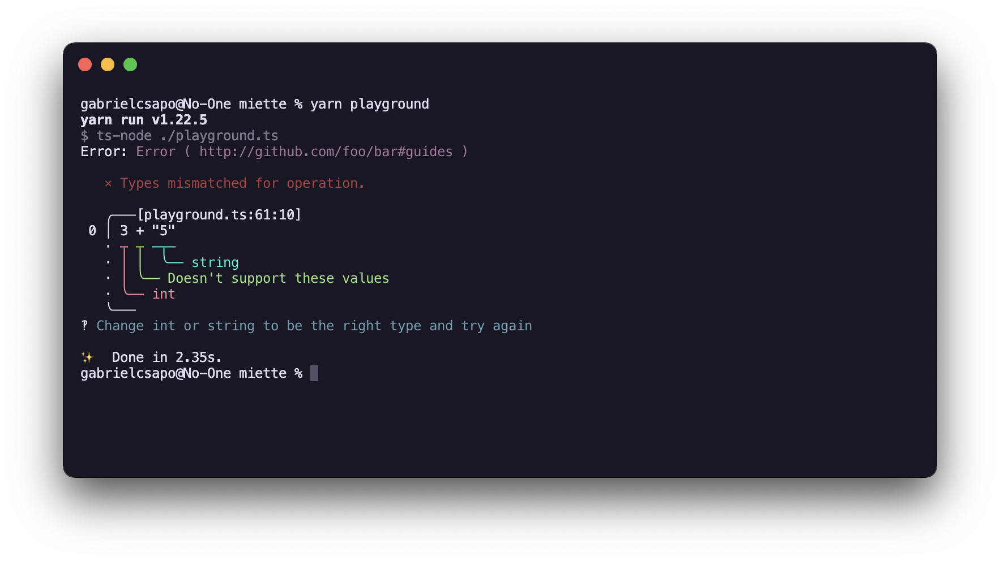

# miette

> Fancy upgrade to console output

> > This is early days! Until we hit 1.0.0 the API is subject to change. Help us out in understanding what your use case is and how we can harden the API layer to be helpful in your project!



## What is this?

Inspired by [https://github.com/zkat/miette](https://github.com/zkat/miette) this library aims to make error logging and diagnostic messages more user friendly!

## Installation

```
npm install miette --save
```

## Usage

For the API layer and general examples please visit the [api website](https://gabrielcsapo.github.io/miette)!

### Playground

For a quick and easy playground environment just simply clone this repo and run:

```
npm run playground
```

## Development

This is a lerna repo, simply running `npm install` at the top level will allow you to install all the dependencies necessary.

Once you have installed all dependencies you can `cd` into `packages/miette` to add functionality or adds tests as necessary.
